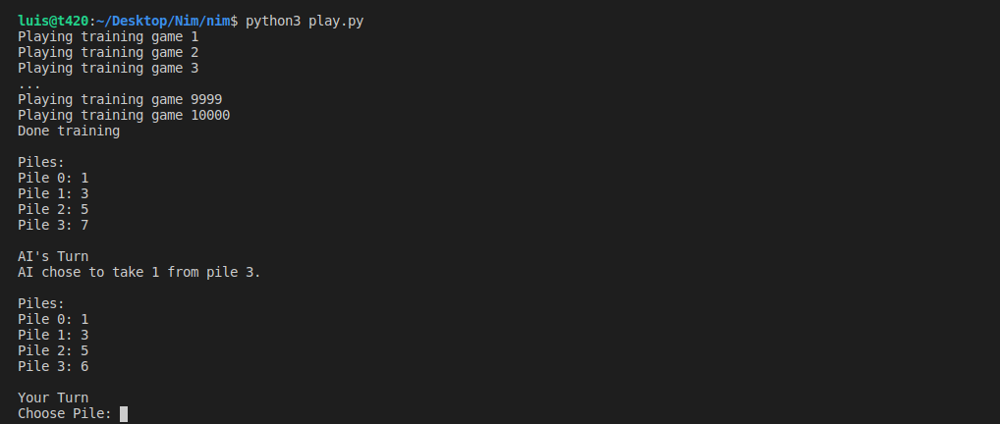

# Nim

## An AI that teaches itself to play Nim through reinforcement learning.

In the game Nim, we begin with some number of piles, each with some number of objects. Players take turns: on a player’s turn, the player removes any non-negative number of objects from any one non-empty pile. Whoever removes the last object loses.

There’s some simple strategy we might imagine for this game: if there’s only one pile and three objects left in it, and it’s your turn, your best bet is to remove two of those objects, leaving your opponent with the third and final object to remove. But if there are more piles, the strategy gets considerably more complicated.

For this project, we built an AI to learn the strategy for this game through reinforcement learning. By playing against itself repeatedly and learning from experience, eventually our AI will learn which actions to take and which actions to avoid.

**Reinforcement Learning**

Reinforcement learning is an approach to machine learning, where after each action, the agent gets feedback in the form of reward or punishment (a positive or a negative numerical value).

The learning process starts by the environment providing a state to the agent. Then, the agent performs an action on the state. Based on this action, the environment will return a state and a reward to the agent, where the reward can be positive, making the behavior more likely in the future, or negative (i.e. punishment), making the behavior less likely in the future.

A “state” of the Nim game is just the current size of all of the piles. A state, for example, might be `[1, 1, 3, 5]`, representing the state with 1 object in pile 0, 1 object in pile 1, 3 objects in pile 2, and 5 objects in pile 3. An “action” in the Nim game will be a pair of integers `(i, j)`, representing the action of taking `j` objects from pile `i`. So the action `(3, 5)` represents the action “from pile 3, take away 5 objects.” Applying that action to the state `[1, 1, 3, 5]` would result in the new state `[1, 1, 3, 0]` (the same state, but with pile 3 now empty).

**Q-Learning**

Q-Learning is one model of reinforcement learning, where a function `Q(s, a)` outputs an estimate of the value of taking action `a` in state `s`. A way to train a reinforcement learning model is to give feedback not upon every move, but upon the end of the whole process. In Nim game, an untrained AI will play randomly, and it will be easy to win against it. To train the AI, it will start from playing a game randomly, and in the end get a reward of 1 for winning and -1 for losing, an action that results in the game continuing has an immediate reward of `0`. When it is trained on 10,000 games, for example, it is already smart enough to be hard to win against it.

The model starts with all estimated values equal to `0` `(Q(s,a) = 0 for all s, a)`. When an action is taken and a reward is received, the function does two things: 1) it estimates the value of `Q(s, a)` based on current reward and expected future rewards, and 2) updates `Q(s, a)` to take into account both the old estimate and the new estimate. This gives us an algorithm that is capable of improving upon its past knowledge without starting from scratch. The key formula for Q-learning is below. Every time we are in a state `s` and take an action `a`, we can update the Q-value `Q(s, a)` according to:

`Q(s, a) <- Q(s, a) + α(new value estimate - old value estimate)`

In the above formula, alpha `α` is the learning rate (how much we value new information compared to information we already have). The new value estimate represents the sum of the reward received for the current action and the estimate of all the future rewards that the player will receive. The old value estimate is just the existing value for `Q(s, a)`. By applying this formula every time our AI takes a new action, over time our AI will start to learn which actions are better in any state. The updated value of `Q(s, a)` is equal to the previous value of `Q(s, a)` in addition to some updating value. This value is determined as the difference between the new value and the old value, multiplied by `alpha`, a learning coefficient. When `alpha = 1` the new estimate simply overwrites the old one. When `alpha = 0`, the estimated value is never updated. By raising and lowering `alpha`, we can determine how fast previous knowledge is being updated by new estimates.

The new value estimate can be expressed as a sum of the reward and the future reward estimate. To get the future reward estimate, we consider the new state that we got after taking the last action, and add the estimate of the action in this new state that will bring to the highest reward. This way, we estimate the utility of making action `a` in state `s` not only by the reward it received, but also by the expected utility of the next step. The value of the future reward estimate can sometimes appear with a coefficient gamma `ɣ` that controls how much future rewards are valued. We end up with the following equation:

`Q(s, a) <- Q(s, a) + α((reward + ɣ(max a' Q(s', a'))) - Q(s, a))`

**Explore vs. Exploit**

A Greedy Decision-Making algorithm completely discounts the future estimated rewards, instead always choosing the action `a` in current state `s` that has the highest `Q(s, a)`. A greedy algorithm always exploits, taking the actions that are already established to bring to good outcomes. However, it will always follow the same path to the solution, never finding a better path. 

Exploration, on the other hand, means that the algorithm may use a previously unexplored route on its way to the target, allowing it to discover more efficient solutions along the way. 

To implement the concept of exploration and exploitation, we can use the epsilon `ε` greedy algorithm. In this type of algorithm, we set `ε` equal to how often we want to move randomly. With probability `1-ε`, the algorithm chooses the best move (exploitation). With probability `ε`, the algorithm chooses a random move (exploration).

----------------------------------------------------------
## Implementation

`shopping.csv` contains the data set for this project. There are about 12,000 user sessions represented in this spreadsheet. The first six columns measure the different types of pages users have visited in the session: the `Administrative`, `Informational`, and `ProductRelated` columns measure how many of those types of pages the user visited, and their corresponding `_Duration` columns measure how much time the user spent on any of those pages. The `BounceRates`, `ExitRates`, and `PageValues` columns measure information from Google Analytics about the page the user visited. `SpecialDay` is a value that measures how closer the date of the user’s session is to a special day (like Valentine’s Day or Mother’s Day). `Month` is an abbreviation of the month the user visited. `OperatingSystems`, `Browser`, `Region`, and `TrafficType` are all integers describing information about the user themself. `VisitorType` will take on the value `Returning_Visitor` for returning visitors and some other string value for non-returning visitors. `Weekend` is `TRUE` or `FALSE` depending on whether or not the user is visiting on a weekend.

Perhaps the most important column, though, is the last one: the `Revenue` column. This is the column that indicates whether the user ultimately made a purchase or not: `TRUE` if they did, `FALSE` if they didn’t. This is the column that we’d predict (the “label”), based on the values for all of the other columns (the “evidence”).

At `shopping.py`, the main function loads data from the CSV spreadsheet by calling the `load_data` function and splits the data into a training and testing set. The `train_model` function is then called to train a machine learning model on the training data. Then, the model is used to make predictions on the testing data set. Finally, the `evaluate` function determines the sensitivity and specificity of the model, before the results are ultimately printed to the terminal.

**Specification**

The `load_data` function accepts the CSV filename as its argument, open that file, and return a tuple `(evidence, labels)`. `evidence` is a list of all of the evidence for each of the data points, and `labels` is a list of all of the labels for each data point.

Since there's one piece of evidence and one label for each row of the spreadsheet, the length of the `evidence` list and the length of the `labels` list is equal to the number of rows in the CSV spreadsheet (excluding the header row). The lists are ordered according to the order the users appear in the spreadsheet. That is to say, `evidence[0]` is the evidence for the first user, and `labels[0]` is the label for the first user.

Each element in the `evidence` list is itself a list. The list is of length 17: the number of columns in the spreadsheet excluding the final column (the label column).

The values in each evidence list are in the same order as the columns that appear in the evidence spreadsheet.

Note that, to build a nearest-neighbor classifier, all of our data needs to be numeric. So, the values are being converted to the following types:

- `Administrative`, `Informational`, `ProductRelated`, `Month`, `OperatingSystems`, `Browser`, `Region`, `TrafficType`, `VisitorType`, and `Weekend` are all of type `int`.

- `Administrative_Duration`, `Informational_Duration`, `ProductRelated_Duration`, `BounceRates`, `ExitRates`, `PageValues`, and `SpecialDay` are all of type `float`.

- `Month` is `0` for January, `1` for February, `2` for March, etc. up to `11` for December.

- `VisitorType` is `1` for returning visitors and `0` for non-returning visitors.

- `Weekend` is `1` if the user visited on a weekend and `0` otherwise.

- Each value of `labels` is either the integer `1`, if the user did go through with a purchase, or `0` otherwise.

For example, the value of the first evidence list is `[0, 0.0, 0, 0.0, 1, 0.0, 0.2, 0.2, 0.0, 0.0, 1, 1, 1, 1, 1, 1, 0]` and the value of the first label is `0`.

The `train_model function` accepts a list of evidence and a list of labels, and returns a scikit-learn nearest-neighbor classifier (a k-nearest-neighbor classifier where k = 1) fitted on that training data. By importing `KNeighborsClassifier` from `sklearn.neighbors` we can use a k-nearest-neighbors classifier in this function.

The `evaluate` function accepts a list of labels (the true labels for the users in the testing set) and a list of predictions (the labels predicted by our classifier), and returns two floating-point values `(sensitivity, specificity)`.

- `sensitivity` is a floating-point value from `0` to `1` representing the “true positive rate”: the proportion of actual positive labels that were accurately identified.

- `specificity` is a floating-point value from `0` to `1` representing the “true negative rate”: the proportion of actual negative labels that were accurately identified.

We assume that the list of true labels will contain at least one positive label and at least one negative label.

## Resources

* [Learning - Lecture 4 - CS50's Introduction to Artificial Intelligence with Python 2020][cs50 lecture]

## Usage

**To install Scikit-learn:**

* Inside the `shopping` directory: `pip3 install scikit-learn`

**To train and test a model to predict online shopping purchases:** 

* Inside the `shopping` directory: `python shopping.py shopping.csv`

## Acknowledgements

Project and images from the course [CS50's Introduction to Artificial Intelligence with Python 2020][cs50 ai] from HarvardX.

Data set provided by [Sakar, C.O., Polat, S.O., Katircioglu, M. et al. Neural Comput & Applic (2018)][dataset].

## Credits

[*Luis Sanchez*][linkedin] 2021.

[cs50 lecture]: https://www.youtube.com/watch?v=E4M_IQG0d9g
[linkedin]: https://www.linkedin.com/in/luis-sanchez-13bb3b189/
[cs50 ai]: https://cs50.harvard.edu/ai/2020/
[dataset]: https://link.springer.com/article/10.1007/s00521-018-3523-0
